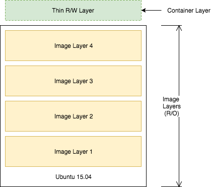

# learning_docker

## Source
[Docker Essentials: A Developer Introduction](https://cognitiveclass.ai/courses/docker-essentials/)

## Playground
[Play with Docker](https://labs.play-with-docker.com)
> needs docker hub account: https://hub.docker.com/
  
# L1 - Run your first container

## What are containers

- They are nothing more than a process or group of processes that are running in isolation. 
- They run on a shared kernel
- the isolation is provided by __linux namespaces__
    - each container has it's own set of "namespaces":
        - __PID__ - process IDs
        - __USER__ - user and group IDs
        - __UTS__ - hostname and domain name
        - __NS__ - mount points
        - __NET__ - network devices, stacks, ports
        - __IPC__ - inter-process communications, message queues
- __cgroups__ (another linux feature) controls limits and monitoring or resources

### VMs vs Container


## Run a container

Image vs Container  

An image is the blueprint for spinning up containers. An image is a TAR of a file system, and a container is a file system plus a set of processes running in isolation.

```shell
docker container run -t ubuntu top
```
- `docker container run` run a container with Ubuntu image
- run `top` command, in that container
- `-t` flag allocates a pseudo-TTY (so that `top` command will work correctly)
- `docker run` command first starts a `docker pull` command to download the Ubuntu image onto your host, and then it will start the container
- when done, stop it with `<ctrl>+c`

Inspect the container from a different process:
- `docker container exe` - allows you to enter a running container's namespaces with a new process
- `docker container ls` - to list current containers
- after you get the container ID, you can use it like this: `docker container exec -it [container ID] bash`
- `-it` - gives interactive (open STDIN) TTY console
- `bash` - runs bash in the new console
- `ps -ef` - to check the running processes in the given Ubuntu container (you can run it outside, and see the difference)

## Run multiple containers

[Docker Hub](https://hub.docker.com/) is the public central registry for Docker images. Find one that you would like to use there. 

> Try to avoid using unverified content from Docker, as some images might contain security vulnerabilities or even malicious software.

Next, we will use NGINX web server and MongoDB:

1. Run an NGINX server

```shell
docker container run --detach --publish 8080:80 --name nginx nginx
```
- `--detach` - run the container in background
- `--publish` - publish port 80 in the container by using port 8080 on your host
- `--name` - every container has a name. If you don't give one, Docker makes one up (funny ones even)
- `nginx` - (last one) is the same as `nginx:latest` (image_name:version_tag)

2. Run a MongoDB server

```shell
docker container run --detach --publish 8081:27017 --name mongo mongo:3.4
```
- `mongo:3.4` - instead of using the default __latest__ tag, we use specific __3.4__ version

Check you containers:
```shell
docker container ls
```
Output should be similar to:
```shell
CONTAINER ID        IMAGE               COMMAND                  CREATED             STATUS              PORTS                     NAMES
e4915cc89e5c        mongo:3.4           "docker-entrypoint.s…"   32 seconds ago      Up 29 seconds       0.0.0.0:8081->27017/tcp   mongo
5742570ace3d        nginx               "nginx -g 'daemon of…"   4 minutes ago       Up 4 minutes        0.0.0.0:8080->80/tcp      nginx
```

## Remove the containers

Run this command for each container that you want to stop
```shell
docker container stop [container id]
```
You can reference them by the name or container ID. If you use the ID, you only need to enter enough digits so that the ID is unique (usually 3 will suffice).
```shell
docker container stop e49 574
```

Remove the stopped containers

`docker container list -a` - to list all containers

```shell
docker system prune
```
This command will remove any stopped containers, unused volumes and networks, and dangling images.


# L2 - Add CI/CD value with Docker images

## Create a sample Python app

- it can be done with any other programming language (it will change the requirements going forward).  
- we create this sample python app locally, so we can dockerize it later.
- see [Sample python app](app.py).
- Pre-reqs: python 3, Flask (not needed if you don't want to test the app locally)

## Create and build the Docker image

- see [Dockerfile](Dockerfile) built for this example
- a Dockerfile lists the instructions needed to build a Docker image
- explanation for the content of our Dockerfile:
    - `FROM python:3.6.1-alpine`
        - starting point for our Dockerfile
        - every Dockerfile typically starts with a `FROM` line that is the starting image to build your layers on top of
        - `3.6.1-alpine` is the tag for this Python image. Check all available tags at [Python Image](https://hub.docker.com/_/python/). If no tag is specified, then `latest` will be used.
        - if you want more customization power over your image, you can start at a higher level, by taking the Dockerimage of python, which in this case starts with a `FROM alpine` statement, and alter the subsequent commands yourself as needed.
    - `RUN pip install flask`
        - the `RUN` command executes commands needed to set up your image for your application, such as installing packages, editing files, or changing file permissions.
        - in this case, we are installing flask.
        - the `RUN` commands are executed at build time and are added to the layers of your image
    - `CMD ["python","app.py"]`
        - `CMD` is the command that is executed when you start a container
        - here we are using `CMD` to run our Python application
        - there can be only one `CMD` per Dockerfile! if you specify more, then the last one will take effect
        - we can use the official Python image directly to run Python scripts withouts installing Python on our machine. However, in our case, we want to create a custom image that includes our source along side the needed requirements, so that we can ship it to other environments directly
    - `COPY app.py /app.py`
        - copies the `app.py` file from the local directory (place where you will run `docker image build` command) into a new layer of the image
        - this instruction is the last line in Dockerfile. Layers that change frequently, such as copying source code into the image, should be placed near the bottom of the file to take full advantage of the Docker layer cache. This allows us to avoid rebuilding layers that could otherwise be cached. For instance, if there would be a change in the `FROM` instruction, it would invalidate the cache for all subsequent layers of this image
        - it seems counter-intuitive to put this line after the `CMD ["python","app.py"]` line. The CMD line is executed only when the container is started, so you won't get a _file not found_ error here
- for a full list of commands available to build a Docker Image, see [doc](https://docs.docker.com/engine/reference/builder/).

To build our image we run the following command:
```
docker image build -t python-hello-world .
```
Check the image newly created, and run it
```
docker image ls
docker run -p 5001:5000 -d python-hello-world
```
Now navigate to http://localhost:5001/. You should shee "Hello World!" in your browser window.  
If needed, you can check the log of your app by using:
```
docker container logs [container_id]
```

The Dockerfile is used to create reproducible builds for your application. A common workflow is to have your CI/CD automation run docker image build as part of its build process. After images are built, they will be sent to a central registry where they can be accessed by all environments (such as a test environment) that need to run instances of that application.

## Push to a central registry

- pre-req: account on https://hub.docker.com/

1. Log in to the Docker registry account:
```
docker login
```
2. Tag the image with your username:
- the naming convention is to tag your image with [dockerhub username][image name]
```
docker tag python-hello-world [dockerhub username]/python-hello-world
```
3. Push the image to the Docker Hub registry:
```
docker push dumitrualex/python-hello-world 
```

You can now check it on Docker repository:  
https://cloud.docker.com/u/dumitrualex/repository/list  (personal view while logged in as owner)
https://hub.docker.com/r/dumitrualex/python-hello-world (public view)
https://hub.docker.com/u/dumitrualex (public list with all my repositories)

Now that the image is on Docker Hub, other developers and operators can use the `docker pull` command to deploy our image to other environments.

> __Remember__: Docker images contain all the dependencies that they need to run an application within the image. This is useful because you no longer need to worry about environment drift (version differences) when you rely on dependencies that are installed on every environment you deploy to. You also don't need to follow more steps to provision these environments. Just one step: install docker, and that's it.

## Deploy a change

Let's say we have made an update to our application source file.
- change text from "Hello World" to "Hello Everyone".

Now we need to rebuild our Docker image. We are using the same command:
```
docker image build -t python-hello-world .
```
- but now we notice the cache in action. Notice the "Using cache" for Steps 1 - 3. These layers of the Docker image have already been built, and the docker image build command will use these layers from the cache instead of rebuilding them.

Same goes for `push`
```
docker push dumitrualex/python-hello-world 
```
- there is a caching mechanism in place for pushing layers too. Docker Hub already has all but one of the layers from an earlier push, so it only pushes the one layer that has changed. For the others, it displays "Layer already exists".

When you change a layer, every layer built on top of that will have to be rebuilt. Each line in a Dockerfile builds a new layer that is built on the layer created from the lines before it. This is why the order of the lines in your Dockerfile is important. You optimized your Dockerfile so that the layer that is most likely to change (`COPY app.py /app.py`) is the last line of the Dockerfile. Generally for an application, your code changes at the most frequent rate. This optimization is particularly important for CI/CD processes where you want your automation to run as fast as possible.

## Understand image layers

One of the important design properties of Docker is its use of the union file system.

Consider the Dockerfile that you created before:
```docker
FROM python:3.6.1-alpine
RUN pip install flask
CMD ["python","app.py"]
COPY app.py /app.py
```

Each of these lines is a layer. Each layer contains only the delta, or changes from the layers before it. To put these layers together into a single running container, Docker uses the union file system to overlay layers transparently into a single view.

Each layer of the image is read-only except for the top layer, which is created for the container. The read/write container layer implements "copy-on-write," which means that files that are stored in lower image layers are pulled up to the read/write container layer only when edits are being made to those files. Those changes are then stored in the container layer.

The "copy-on-write" function is very fast and in almost all cases, does not have a noticeable effect on performance. You can inspect which files have been pulled up to the container level with the `docker diff` command. For more information, see the command-line reference on the [docker diff](https://docs.docker.com/engine/reference/commandline/diff/) command.



Because image layers are read-only, they can be shared by images and by running containers. For example, creating a new Python application with its own Dockerfile with similar base layers will share all the layers that it had in common with the first Python application.

```docker
FROM python:3.6.1-alpine
RUN pip install flask
CMD ["python","app2.py"]
COPY app2.py /app2.py
```


You can also see the sharing of layers when you start multiple containers from the same image. Because the containers use the same read-only layers, you can imagine that starting containers is very fast and has a very low footprint on the host.

You might notice that there are duplicate lines in this Dockerfile and the Dockerfile that we created earlier. Although this is a trivial example, we can pull common lines of both Dockerfiles into a base Dockerfile, which we can then point to with each of your child Dockerfiles by using the FROM command.

Image layering enables the docker caching mechanism for builds and pushes. For example, the output for our last docker push shows that some of the layers of our image already exist on the Docker Hub.

To look more closely at layers, you can use:
```
docker image history [image id]
```
- Each line represents a layer of the image
- notice that the top lines match to the Dockerfile that we created, and the lines below are pulled from the parent Python image. 
- don't worry about the `<missing>` tags. These are still normal layers; they have just not been given an ID by the Docker system.

## Remove containers

- Get a list of running containers with `docker container ls`
- Stop specific one with `docker container stop [container id]`
- Remove stopped containers with `docker system prune`


# L3 - Orchestrate applications with Docker Swarm

Container orchestrators:
- kubernetes
- docker swarm (built into Docker Engine)
- mesos

## Create our first swarm

> done on  Play-with-Docker

Initialize a swarm on node 1:
```
docker swarm init --advertise-addr eth0
```
Output:
```
Swarm initialized: current node (yq2ohizwldax6kzvzamoape0x) is now a manager.

To add a worker to this swarm, run the following command:

    docker swarm join --token SWMTKN-1-068sucsdz1hsa2pj39m0z1nl2fj2gx227xhgzspaxm32ecahd8-88zl9a3kn3e0ts91ug6kh2ydo 192.168.0.33:2377

To add a manager to this swarm, run 'docker swarm join-token manager' and follow the instructions.
```
- think of Docker Swarm as a special mode that is activated by the command: `docker swarm init`
- the `--advertise-addr` option specifies the address in which the other nodes will use to join the swarm
- a join token is created. We need to use this token to join the other nodes to the swarm (see generated command in the output)

On node 2 & 3 copy/paste the command:
```
docker swarm join --token SWMTKN-1-068sucsdz1hsa2pj39m0z1nl2fj2gx227xhgzspaxm32ecahd8-88zl9a3kn3e0ts91ug6kh2ydo 192.168.0.33:2377
```

On node 1, we can run `docker node ls` to see the nodes in our cluster
```
docker node ls
```
Output:
```
ID                            HOSTNAME            STATUS              AVAILABILITY        MANAGER STATUS      ENGINE VERSION
yq2ohizwldax6kzvzamoape0x *   node1               Ready               Active              Leader              18.09.4
j9u9msfsigv2ni2ns8qv97bwr     node2               Ready               Active                                  18.09.4
sbsxs70aj9fbtd8fbbnuri4zf     node3               Ready               Active                                  18.09.4
```
- this swarm has 1 manager and 2 workers
- managers handle commands and manage the state of the swarm
- workers cannot handle commands and are simply used to run containers at scale
- by default, managers are also used to run containers

> __Note__: Although you control the swarm directly from the node in which its running, you can control a Docker swarm remotely by connecting to the Docker Engine of the manager by using the remote API or by activating a remote host from your local Docker installation (using the $DOCKER_HOST and $DOCKER_CERT_PATH environment variables). This will become useful when you want to remotely control production applications, instead of using SSH to directly control production servers.

## Deploy our first service

To run containers on a Docker Swarm, we need to create a service. A service is an abstraction that represents multiple containers of the same image deployed across a distributed cluster

Let's do it using NGINX

1. Create a service with one running container (will scale later)
```
docker service create --detach=true --name nginx1 --publish 80:80  --mount source=/etc/hostname,target=/usr/share/nginx/html/index.html,type=bind,ro nginx:1.12
```

- this command statement is declarative, and Docker Swarm will try to maintain the state declared in this command unless explicitly changed by another docker service command. 
- this behavior is useful when nodes go down, for example, and containers are automatically rescheduled on other nodes

Parameters explained:  
- `--mount` - this flag is useful to have NGINX print out the hostname of the node it's running on. Used later for load balancing between multiple containers of NGINX that are distributed across different nodes in the cluster and we want to see which node in the swarm is serving the request.  
- `--publish` - uses the swarm's built-in routing mesh. In this case, port 80 is exposed on every node in the swarm. The routing mesh will route a request coming in on port 80 to one of the nodes running the container. 

2. Inspect your service:

```
docker service ls
```
Output:
```
ID                  NAME                MODE                REPLICAS            IMAGE               PORTS
a7bizgtmj8mf        nginx1              replicated          1/1                 nginx:1.12          *:80->80/tcp
```

3. Check the running container of the service

To take a deeper look at the running tasks, use the following command. A task is another abstraction in Docker Swarm that represents the running instances of a service. In this case, there is a 1-1 mapping between a task and a container.
```
docker service ps nginx1
```
Output:
```
ID                  NAME                IMAGE               NODE                DESIRED STATE       CURRENT STATE           ERROR    PORTS
d778y6nc90ed        nginx1.1            nginx:1.12          node1               Running             Running 2 minutes ago
```
If you know on which node your container is running on (see __NODE__ column in Output above), you can use `docker container ls` to see the container running on that specific node.

4. Test the service

Because of the routing mesh, you can send a request to any node of the swarm on port 80. This request will be automatically routed to the one node that is running the NGINX container.

```
curl localhost:80
```
Output:
```
node1
```
- cURL will output the hostname where the container is running, in our case _node1_

## Scaling our service

In production, we might need to handle large amounts of traffic for our application, so we need to scale it up.

1. Update the service to increase the number of replicas (currently just 1)

```
docker service update --replicas=5 --detach=true nginx1
```
Output:
```
ID                  NAME                MODE                REPLICAS            IMAGE               PORTS
vkyj2781q3dj        nginx1              replicated          5/5                 nginx:1.12          *:80->80/tcp
```
- we increase the number of replicas to 5 (info is stored in swarm's internal storage)
- Docker Swarm recognizes that the current number does not match with the declared state of 5, so it schedules 4 more tasks (containers) in an attempt to meet the declared state of service

2. Check the running instances
```
docker service ps nginx1
```
Output:
```
ID                  NAME                IMAGE               NODE                DESIRED STATE       CURRENT STATE            ERROR     PORTS
d778y6nc90ed        nginx1.1            nginx:1.12          node1               Running             Running 39 minutes ago
v5klqwdsmf69        nginx1.2            nginx:1.12          node2               Running             Running 2 minutes ago
y1lzivwd1ohd        nginx1.3            nginx:1.12          node1               Running             Running 2 minutes ago
e8rd0430h7l5        nginx1.4            nginx:1.12          node3               Running             Running 2 minutes ago
nlsd50mbcjz7        nginx1.5            nginx:1.12          node2               Running             Running 2 minutes ago
```
- notice that the containers are scheduled across all 3 nodes of the cluster
- the default placement strategy that is used to decide where new containers are to be run is the emptiest node, but that can be changed based on our needs.

3. Stress test our application 
- the published port did not changed after our update (still 80)
- however, now when we send requests on port 80, the routing mesh has multiple containers in which to route requests to
- the routing mesh acts as a load balancer for these containers, alternating where it routes requests to

Let's try cURL several times against our application:

```shell
$ curl localhost:80
node2
[node2] (local) root@192.168.0.37 ~
$ curl localhost:80
node2
[node2] (local) root@192.168.0.37 ~
$ curl localhost:80
node3
[node2] (local) root@192.168.0.37 ~
$ curl localhost:80
node1
[node2] (local) root@192.168.0.37 ~
$ curl localhost:80
node1
[node2] (local) root@192.168.0.37 ~
$ curl localhost:80
node2
[node2] (local) root@192.168.0.37 ~
$ curl localhost:80
node2
[node2] (local) root@192.168.0.37 ~
$ curl localhost:80
node3
[node2] (local) root@192.168.0.37 ~
$ curl localhost:80
node1
[node2] (local) root@192.168.0.37 ~
$ curl localhost:80
node1
[node2] (local) root@192.168.0.37 ~
$ curl localhost:80
node2
[node2] (local) root@192.168.0.37 ~
```
- we can see that the response differs. This comes from our previous `--mount` command, when we created the service, because we mapped `index.html` file to the `/etc/hostname` so the web page on http://localhost:80/ is just serving us the hostname (i.e. specific node)

>__Limits of the routing mesh__: The routing mesh can publish only one service on port 80. If we want multiple services exposed on port 80, we can use an external application load balancer outside of the swarm to accomplish this.

4. Check the aggregated logs for the service

Another way to see which nodes those requests were routed to is to check the aggregated logs.

```
docker service logs nginx1
```
Output:
```
nginx1.4.e8rd0430h7l5@node3    | 10.255.0.3 - - [30/May/2019:07:55:46 +0000] "GET / HTTP/1.1" 200 6 "-" "curl/7.64.0" "-"
nginx1.4.e8rd0430h7l5@node3    | 10.255.0.3 - - [30/May/2019:07:55:47 +0000] "GET / HTTP/1.1" 200 6 "-" "curl/7.64.0" "-"
nginx1.5.nlsd50mbcjz7@node2    | 10.255.0.3 - - [30/May/2019:07:55:45 +0000] "GET / HTTP/1.1" 200 6 "-" "curl/7.64.0" "-"
nginx1.5.nlsd50mbcjz7@node2    | 10.255.0.3 - - [30/May/2019:07:55:47 +0000] "GET / HTTP/1.1" 200 6 "-" "curl/7.64.0" "-"
nginx1.1.d778y6nc90ed@node1    | 10.255.0.4 - - [30/May/2019:07:17:37 +0000] "GET / HTTP/1.1" 200 6 "-" "curl/7.64.0" "-"
nginx1.1.d778y6nc90ed@node1    | 10.255.0.3 - - [30/May/2019:07:55:47 +0000] "GET / HTTP/1.1" 200 6 "-" "curl/7.64.0" "-"
nginx1.1.d778y6nc90ed@node1    | 10.255.0.3 - - [30/May/2019:07:55:48 +0000] "GET / HTTP/1.1" 200 6 "-" "curl/7.64.0" "-"
nginx1.3.y1lzivwd1ohd@node1    | 10.255.0.3 - - [30/May/2019:07:55:46 +0000] "GET / HTTP/1.1" 200 6 "-" "curl/7.64.0" "-"
nginx1.3.y1lzivwd1ohd@node1    | 10.255.0.3 - - [30/May/2019:07:55:47 +0000] "GET / HTTP/1.1" 200 6 "-" "curl/7.64.0" "-"
nginx1.5.nlsd50mbcjz7@node2    | 10.255.0.3 - - [30/May/2019:07:55:48 +0000] "GET / HTTP/1.1" 200 6 "-" "curl/7.64.0" "-"
nginx1.2.v5klqwdsmf69@node2    | 10.255.0.3 - - [30/May/2019:07:55:46 +0000] "GET / HTTP/1.1" 200 6 "-" "curl/7.64.0" "-"
nginx1.2.v5klqwdsmf69@node2    | 10.255.0.3 - - [30/May/2019:07:55:47 +0000] "GET / HTTP/1.1" 200 6 "-" "curl/7.64.0" "-"
nginx1.2.v5klqwdsmf69@node2    | 10.255.0.3 - - [30/May/2019:07:59:56 +0000] "GET / HTTP/1.1" 200 6 "-" "Mozilla/5.0 (Windows NT 10.0; Win64; x64) AppleWebKit/537.36 (KHTML, like Gecko) Chrome/73.0.3683.86 Safari/537.36" "-"
nginx1.2.v5klqwdsmf69@node2    | 2019/05/30 07:59:56 [error] 11#11: *3 open() "/usr/share/nginx/html/favicon.ico" failed (2: No such file or directory), client: 10.255.0.3, server: localhost, request: "GET /favicon.ico HTTP/1.1", host: "ip172-18-0-60-bjno2b9lhjkg009a8iug-80.direct.labs.play-with-docker.com", referrer: "http://ip172-18-0-60-bjno2b9lhjkg009a8iug-80.direct.labs.play-with-docker.com/"
nginx1.2.v5klqwdsmf69@node2    | 10.255.0.3 - - [30/May/2019:07:59:56 +0000] "GET /favicon.ico HTTP/1.1" 404 571 "http://ip172-18-0-60-bjno2b9lhjkg009a8iug-80.direct.labs.play-with-docker.com/" "Mozilla/5.0 (Windows NT 10.0; Win64; x64) AppleWebKit/537.36 (KHTML, like Gecko) Chrome/73.0.3683.86 Safari/537.36" "-"
```
- the output from every running container (`docker container logs [container id]`) is aggregated into one output
- in addition to seeing whether the request was sent to _node1_, _node2_, or _node3_, you can also see which container on each node that it was sent to
- for example, nginx1.5 means that request was sent to a container with that same name as indicated in the output of the command `docker service ps nginx1`

## Apply rolling updates

Let's update the version of NGINX to 1.13.

1. Run update command:
```
docker service update --image nginx:1.13 --detach=true nginx1
```

Results captured over few snapshots:
```
$ docker service ps nginx1
ID                  NAME                IMAGE               NODE                DESIRED STATE       CURRENT STATE            ERROR     PORTS
xfai2py4xs6j        nginx1.1            nginx:1.13          node3               Running             Running 6 seconds ago
d778y6nc90ed         \_ nginx1.1        nginx:1.12          node1               Shutdown            Shutdown 7 seconds ago
v5klqwdsmf69        nginx1.2            nginx:1.12          node2               Running             Running 25 minutes ago
y1lzivwd1ohd        nginx1.3            nginx:1.12          node1               Running             Running 25 minutes ago
kgcswwrze5bk        nginx1.4            nginx:1.13          node1               Running             Running 1 second ago
e8rd0430h7l5         \_ nginx1.4        nginx:1.12          node3               Shutdown            Shutdown 2 seconds ago
wjqrcvvfbq5z        nginx1.5            nginx:1.13          node3               Ready               Ready 1 second ago
nlsd50mbcjz7         \_ nginx1.5        nginx:1.12          node2               Shutdown            Running 1 second ago
[node1] (local) root@192.168.0.38 ~
$ docker service ps nginx1
ID                  NAME                IMAGE               NODE                DESIRED STATE       CURRENT STATE                      ERROR               PORTS
xfai2py4xs6j        nginx1.1            nginx:1.13          node3               Running             Running 10 seconds ago
d778y6nc90ed         \_ nginx1.1        nginx:1.12          node1               Shutdown            Shutdown 11 seconds ago
7c5s6ciuyanh        nginx1.2            nginx:1.13          node2               Ready               Preparing less than a second ago
v5klqwdsmf69         \_ nginx1.2        nginx:1.12          node2               Shutdown            Running less than a second ago
y1lzivwd1ohd        nginx1.3            nginx:1.12          node1               Running             Running 25 minutes ago
kgcswwrze5bk        nginx1.4            nginx:1.13          node1               Running             Running 5 seconds ago
e8rd0430h7l5         \_ nginx1.4        nginx:1.12          node3               Shutdown            Shutdown 6 seconds ago
wjqrcvvfbq5z        nginx1.5            nginx:1.13          node3               Running             Running less than a second ago
nlsd50mbcjz7         \_ nginx1.5        nginx:1.12          node2               Shutdown            Shutdown 1 second ago
[node1] (local) root@192.168.0.38 ~
$ docker service ps nginx1
ID                  NAME                IMAGE               NODE                DESIRED STATE       CURRENT STATE             ERROR      PORTS
xfai2py4xs6j        nginx1.1            nginx:1.13          node3               Running             Running 23 seconds ago
d778y6nc90ed         \_ nginx1.1        nginx:1.12          node1               Shutdown            Shutdown 24 seconds ago
7c5s6ciuyanh        nginx1.2            nginx:1.13          node2               Running             Running 8 seconds ago
v5klqwdsmf69         \_ nginx1.2        nginx:1.12          node2               Shutdown            Shutdown 9 seconds ago
rqej3n4rkc92        nginx1.3            nginx:1.13          node1               Running             Running 3 seconds ago
y1lzivwd1ohd         \_ nginx1.3        nginx:1.12          node1               Shutdown            Shutdown 4 seconds ago
kgcswwrze5bk        nginx1.4            nginx:1.13          node1               Running             Running 18 seconds ago
e8rd0430h7l5         \_ nginx1.4        nginx:1.12          node3               Shutdown            Shutdown 19 seconds ago
wjqrcvvfbq5z        nginx1.5            nginx:1.13          node3               Running             Running 13 seconds ago
nlsd50mbcjz7         \_ nginx1.5        nginx:1.12          node2               Shutdown            Shutdown 14 seconds ago
[node1] (local) root@192.168.0.38 ~
$
```

We can fine-tune the rolling update by using these options:
- `--update-parallelism` - specifies the number of containers to update immediately (default is 1)
- `--update-delay` - specifies the delay between finishing updating a set of containers before moving on to the next set

2. Final state (after couple of seconds)

```
$ docker service ps nginx1
```
Output:
```
ID                  NAME                IMAGE               NODE                DESIRED STATE       CURRENT STATE          ERROR   PORTS
xfai2py4xs6j        nginx1.1            nginx:1.13          node3               Running             Running 2 hours ago
d778y6nc90ed         \_ nginx1.1        nginx:1.12          node1               Shutdown            Shutdown 2 hours ago
7c5s6ciuyanh        nginx1.2            nginx:1.13          node2               Running             Running 2 hours ago
v5klqwdsmf69         \_ nginx1.2        nginx:1.12          node2               Shutdown            Shutdown 2 hours ago
rqej3n4rkc92        nginx1.3            nginx:1.13          node1               Running             Running 2 hours ago
y1lzivwd1ohd         \_ nginx1.3        nginx:1.12          node1               Shutdown            Shutdown 2 hours ago
kgcswwrze5bk        nginx1.4            nginx:1.13          node1               Running             Running 2 hours ago
e8rd0430h7l5         \_ nginx1.4        nginx:1.12          node3               Shutdown            Shutdown 2 hours ago
wjqrcvvfbq5z        nginx1.5            nginx:1.13          node3               Running             Running 2 hours ago
nlsd50mbcjz7         \_ nginx1.5        nginx:1.12          node2               Shutdown            Shutdown 2 hours ago
```

## Reconcile problems with containers

The inspect-and-then-adapt model of Docker Swarm enables it to perform reconciliation when something goes wrong. For example, when a node in the swarm goes down, it might take down running containers with it. The swarm will recognize this loss of containers and will attempt to reschedule containers on available nodes to achieve the desired state for that service.


Let's remove a node and and see tasks of our nginx1 service be rescheduled on other nodes automatically:

1. Create a new service from scratch (just to have a clean output)

```
docker service create --detach=true --name nginx2 --replicas=5 --publish 81:80  --mount source=/etc/hostname,target=/usr/share/nginx/html/index.html,type=bind,ro nginx:1.12
```

2. Use `watch` (linux utility) to monitor the output of `docker service ps` command, on node1

```
watch -n 1 docker service ps nginx2
```

3. Remove node3 from the swarm

Run from node3 console:
```
docker swarm leave
```
- this is the typical way to leave the swarm, but we can also just kill the node (behavior will be the same)

4. Reconciliation takes action
- in node1 we should be able to see the swarm attempts to get back the declared state by rescheduling the containers that were running on node3 to node1 and node2 automatically

Result:
```
Every 1s: docker service ps nginx2                                                                                      2019-05-30 10:10:31

ID                  NAME                IMAGE               NODE                DESIRED STATE       CURRENT STATE            ERROR
     PORTS
506hiiq465dy        nginx2.1            nginx:1.12          node2               Running             Running 15 minutes ago

8xcog9zhr40b        nginx2.2            nginx:1.12          node1               Running             Running 2 minutes ago

ytd6tnbonmfg         \_ nginx2.2        nginx:1.12          node3               Shutdown            Running 3 minutes ago

xmn57z760278        nginx2.3            nginx:1.12          node2               Running             Running 15 minutes ago
cl10esbry1fk        nginx2.4            nginx:1.12          node2               Running             Running 2 minutes ago
lzzbh4e618vc         \_ nginx2.4        nginx:1.12          node3               Shutdown            Running 3 minutes ago
v5brbuju2hm7        nginx2.5            nginx:1.12          node1               Running             Running 15 minutes ago

```

## Determine how many nodes we need

Until now we had a Docker Swarm cluster with 1 master and 2 worker nodes.

This configuration is not highly available. The manager node contains the necessary information to manage the cluster, but if this node goes down, the cluster will cease to function. For a production application, we should provision a cluster with multiple manager nodes to allow for manager node failures.

We should have at least three manager nodes but typically no more than seven. Manager nodes implement the raft consensus algorithm, which requires that more than 50% of the nodes agree on the state that is being stored for the cluster. If we don't achieve more than 50% agreement, the swarm will cease to operate correctly. For this reason, note the following guidance for node failure tolerance:

- Three manager nodes tolerate one node failure.
- Five manager nodes tolerate two node failures.
- Seven manager nodes tolerate three node failures.  

It is possible to have an even number of manager nodes, but it adds no value in terms of the number of node failures. For example, four manager nodes will tolerate only one node failure, which is the same tolerance as a three-manager node cluster. However, the more manager nodes we have, the harder it is to achieve a consensus on the state of a cluster.

While we typically want to limit the number of manager nodes to no more than seven, we can scale the number of worker nodes much higher than that. Worker nodes can scale up into the thousands of nodes. Worker nodes communicate by using the gossip protocol, which is optimized to be perform well under a lot of traffic and a large number of nodes.

> On Play-with-Docker, we have templates to help us with this. (click the wrench icon, to access them)